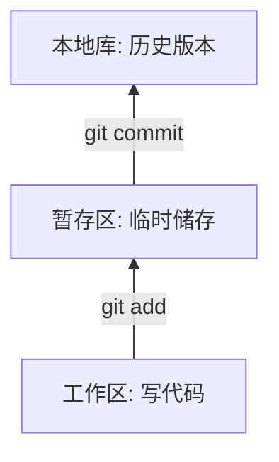

# git 命令

[toc]

## 基本概念图像




## 基本操作

### 初始化
  - `git init`
    - 生成`.git`目录

### 状态查看操作
  - `git status`
### 添加操作
  - `git  add [file name]`
### 提交操作
  - `git commit -m "commit message" [file name] `
### 查看历史记录操作
  - ` git log `
    - 显示详细
  - ` git log --pretty=oneline `
    - 没有用户名和日期
  - ` git log --online `
    - 将hash值缩短并显示不重复的历史记录
  - ` git log reflog `
    - 显示版本的位置(相对于指针HEAD )
### 前进后退

- 基于索引值操作[推荐]
  - ` git reset --hard [局部索引值] `
  - ` git reset --hard 5cb3186 `
    - 配合`git reflog `
- 使用`^`符号：只能后退
  - ` git reset --hard HEAD^ `
    - 一个`^`表示后退一步，n个表示后退n步
- 使用`~`符号：只能后退
  - ` git reset --hard HEAD~n `
    - 表示后退n步

### reset 命令的三个参数对比

- ` --soft `参数

  - 仅仅在本地库移动HEAD指针

  - ```mermaid
    graph TB
    A[原来位置]-->B[本地库]
    C[暂存区]
    D[工作区]
    ```

- ` --mixed `参数

  - 在本地库移动HEAD指针

  - 重置暂存区

  - ```mermaid
    graph TB
    A[原来位置]-->A1[本地库]
    C[原来位置]-->C1[暂存区]
    D[工作区]
    ```

- ` --hard `参数

  - 在本地库移动HEAD指针

  - 重置暂存区

  - 重置工作区

  - ```mermaid
    graph TB
    A[原来位置]-->A1[本地库]
    C[原来位置]-->C1[暂存区]
    D[原来位置]-->D1[工作区]
    ```

### 删除文件并找回

- 前提：删除前，文件存在时的状态提交到了本地库
- 操作：
  - ` git reset --hrad [指针位置] `
  - 删除操作已经提交到本地库：指针位置指向历史记录
  - 删除操作尚未提交到本地库：指针位置使用HEAD

### 比较文件差异

- ` git diff [文件名]`
  - 将工作区中的文件和暂存区进行比较
- ` git diff [本地库中历史版本] [文件名] `
  - 将工作区中的文件和本地库历史记录比较
- ` git diff `
  - 不带文件名变焦多个文件

## 分支管理

### 什么是分支？

- 在把版本过程中， 使用多条线同时推进多个任务

### 分支的好处

- 同时并行推进多个供能开发， 提高开发效率
- 各个分支在开发过程中， 如果某一分支开发失败， 不会对其他分支有任何影响。失败的分支删除重新开始即可。

### 分支操作

- 创建分支
  - ` git branch [分支名] `
- 查看分支
  - ` git branch -v `
- 切换分支
  - ` git checkout [分支名] `
- 合并分支
  - 第一步：切换到接受修改的分支(被合并， 增加新内容)
    - ` git checkout [被合并分支名] `
  - 第二部：执行` merge `命令
    - ` git merge [有新内容分支名]`
- 解决冲突
  - 冲突的表现：修改文件中有不同的修改
  - 冲突的解决
    - 第一步：编辑文件，删除特殊符号
    - 第二步：把文件修改到满意的程度
    - 第三步：` git add [文件名] `
    - 第四步： ` git commit -m "日志信息" `
      - 注意：此时` commit `一定不能带具体文件名

## git 基本原理

### 哈希

​		哈希是一个系列的加密算法， 各个不同的哈希算法虽然加密强度不同， 但是有一下几个共同点：

- 不管输入数据的数据量有多大， 输入同一个哈希算法，得到的加密结果长度固定
- 哈希算法确定，输入数据额确定，输出数据能够保证不变。
- 哈希算法确定，输入数据有变化，输出数据一定有变化， 而且通常变化很大。
  - 利用此特性可以用来验证文件。git 就是靠这种机制从根本上保证数据完整性的。
- 哈希算法不可逆

git 底层采用的是SHA-1算法。

## github

### 创建远程库

- 登录github创建一个仓库

### 创建远程库地址

- ` git remote -v `
  - 查看当前所有远程地址别名
- ` git remote add [别名] [远程地址] `
  - 为远程地址创建别名

### 推送

- ` git push [别名] [分支名]`

### 克隆

- 命令
  - ` git clone [远程地址] `
- 效果
  - 完整的把远程库下载到本地
  - 创建远程地址别名
  - 初始化本地库

### 团队成员邀请

### 拉取

- `pull` = `fetch` + `merge`
- ` git fetch [远程库地址别名] [远程分支名] `
- ` git merge [远程库地址别名/远程分支名] `