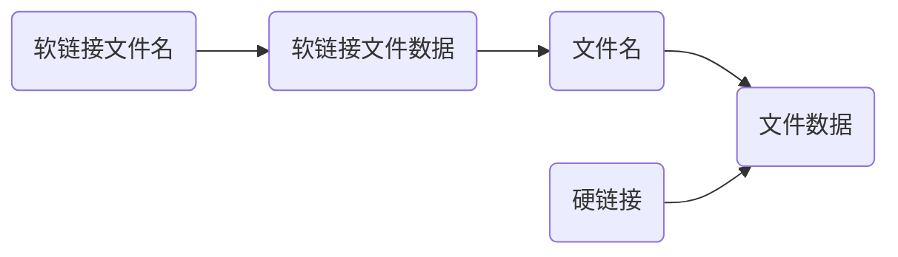

# Linux Note

[toc]

## 文件和目录命令

### 目录命令

#### 目录显示

- `ls `
  - `-l` 以列表显示
  - `-a` 全部(包括隐藏文件)
    - 隐藏文件以`.` 开头
  - `-h` 以人性化的方式显现
  - `-lah`
- `pwd` 显示当前目录
- `tree [目录名]` 以树形结构显示
  - `-d` 只显示目录，不显示文件

#### 目录切换和创建

- `cd ...` 
  - `.` 当前目录
  - `..` 上一级目录
  - `-`  最近两次目录的切换
  - `/` 根目录
  - `~` 家目录
- `mkdir ...`
  - `-p a/b/c` 创建多个目录

### 文件命令

#### 文件创建和删除

- `touch ...` 
  - 更新修改日期
  - 创建文件
- `rm ...`
  - `-r` 删除目录
  - `-f` 强制删除


#### 文件的移动和复制

- `cp 源文件 目标文件` 复制
  - `-i` 覆盖文件的提示
  - `-r` 复制目录  
- `mv 源文件 目标文件` 移动
  - `-i` 覆盖文件的提示
  - 利用mv可以对文件进行重命名

#### 文件的显示

- `cat 文件名` 查看文件内容
  - `-n` 显示行号
  - `-b` 显示非空行的行号
- `more 文件名` 分屏显示文件的内容
  - 空格 显示手册页的下一屏
  - `Enter` 一次滚动一行
  - `b` 回滚一屏
  - `f` 前滚一屏
  - `q` 退出
  - `/word` 搜索word字符

#### 文本搜索

- `grep word 文件`

  - 选项

    - `-n ` 显示行号
    - `-v` 显示不包含匹配文本的所有行
    - `-i` 忽略大小写

  - 参数

    - `^a` 行首，搜索以a开头的行

    - `a$` 行尾，搜索以a结束的行

    - 例如
      ```Linux
      grep -n a$ test.txt
      ```

      

### 管道与重定向

#### 重定向

- `echo` 在终端显示参数指定的文字，通常与重定向联合使用
- `>`和`>>` 将终端显示的内容，输出/追加到指定文件
  - `>` 全覆盖
  - `>>` 添加(追加) 

#### 管道

- `|` 一个命令的输出可以通过管道作为另一个命令的输入

- 常用管道命令

  - `more` 分屏显示

  - `grep` 查询指定文件

  - 例如
     ```linux
    ls -lah ~ |grep -n aaa
    ls -lah ~ |grep -n bbb
    ```
    

### 通配符

- `*` 表示任意多的字符
- `?` 表示任意的字符(单个)
- `[abc]` 匹配a, b, c 中的任一个
- `[a-f]` 匹配a到f的任一个

## 远程管理常用命令

### 关机和重启

- `shutdown` 关机(一分钟)
  - `now` 立即关机
- `shutdown -r ` 重启
  - `now` 立即重启
- `shutdown +10` 再过10分钟关机 

### 查看和配置网卡信息

- `ip addr` 查看ip
- `ping` 检测目标ip地址是否连接正常

## SSH基础

SSH是非常常用的工具，通过SSH客户端我们能连接到运行SSH的远程服务机

### 域名和端口号

- 域名

  - 例如

    ```
    www.itcast.cn
    www.baidu.com
    ```
    
  - 是ip地址的别名，方便用户记忆
  
- 端口号

  - 通过ip地址找到网络上的计算机，通过端口号可以找到计算机上运行的应用程序

  - | 服务器    | 端口号 |
    | --------- | :----: |
    |           |        |
    | SSH服务器 |   22   |
    | HTTPS     |  443   |
    | Web服务器 |   80   |
    | FTP服务器 |   21   |

### SSH客户端的简单使用

- `ssh [-p port] user@remote`

  - `user` 是再远程及其上的用户名，若不指定默认维当前用户
  - `remote` 远程及其地址，可以是ip/域名，也可是别名
  - `port` 是SSH server 监听的端口，若不指定，默认：22

- `scp` 就是secure copy，用来远程copy文件

  - 它的地址格式与ssh基本相同，但要注意，在指定端口时要用大写`-P`

  - 例子

    ```linux
    scp -P 22 01.py user@remote: Desktop/01.py
    scp -r user@remote:~/123.txt  ./123.txt
    ```

- 有关SSH的配置信息都保存再用户家目录下的`.ssh` 目录下

## 用户及权限

### 基本概念

- `r` 可读
- `w` 可写
- `x` 可执行

| 目录  | 用户者权限   | 组权限  | 其他用户权限 |
| ---- | ---------- | ------ | ------------ |
| -(文件) | r  w  -  | r  w  - | r  -  - |
| d(目录) | r  w  x | r  w  x | r  -  x |

硬链接数：有多少方式可以访问到当前目录/文件[^1]

- 绝对路径
- `cd .`
- `cd ..`
- ...

[^1]: 子目录越多，硬连接数越多

### 修改用户权限

- `chmod` 可以修改用户/组对文件/目录的权限
  - `chmod +/-rwx 文件名/目录名` 
- 在python文件中顶上加上`#!/usr/bin/python3` 并在terminal中输入`chmod +x 01.py` 即可将01.py变为可执行文件
  - `./01.py` 运行文件
- 注意：目录的可执行权限去掉后不能再terminal上操作

### 超级用户

linux系统中的root账号通常用于系统的推广和管理，对操作系统的所有资源具有访问权限

- `sudo` su是substitute user的缩写，表示使用另外一个用户身份
  - `sudo` 的预设身份为root

### 组管理终端命令

创建组/删除组的terminal command 都要用`sudo` 执行

- `groupadd 组名` 添加组
- `groupdel 组名` 删除组
- `cat /etc/group` 确认组的信息
- `chgrp [-R] 组名 文件/目录名` (递归)修改文件/目录的所属组

### 用户管理

- `useradd 用户名`
  - `-m` 自动创建用户加目录
  - `-g 组名` 指定用户所在的组，不然则会建一个同名的组
- `passwd 用户名` 
  - 设置密码， 如果是普通用户，直接用passwd可以修改自己的账户密码
- `userdel 用户名` 删除用户
  - `-r` 自动删除用户的家目录
- `cat /etc/passwd | grep 用户名`
  - 新建用户后，用户信息会保存在`/etc/passwd` 中
- `/etc/passwd` 文件存放的是用户信息，由6个分号组成7个信息，分别是
  1. 用户名
  2. 密码(x表示加密的密码)
  3. UID(用户标识)
  4. GID(组标识)
  5. 用户名或本地账号
  6. 家目录
  7. 登录使用shell，就是登录之后使用的终端命令，ubuntu默认是bash
- `usermod` 可以用来设置用户的主组/附加组和登录shell
  - 主组：通常在新建用户时指定，在`/etc/passwd` 的第4列GID对应的组
  - 附加组：在`/etc/group` 中的最后一列表示该组的用户列表，用于指定用户的附加权限
  - `usermod -g 组 用户名`
    - 修改用户的主组(`/etc/passwd` 中的GID)
  - `usermod -G 组 用户名`
    - 修改用户的附加组
  - `usermod -s /bin/bash 用户名`
    - 修改用户登录shell
  - `user -G sudo 用户名`
    - 默认使用`useradd` 添加的用户是没有权限使用`sudo` 以`root` 身份执行命令的. 用以上 命令就可以将用户添加到`sudo` 的附加组
- `su - 用户名`
  - 切换用户，并且切换用户的家目录
  - `-` 可以切换用户家目录，否则位置不变
  - `exit` 退出当前登录用户

### `bin` 和`sbin`

在linux中，绝大多数文件保存在`/bin` 、`/sbin`、 `/usr/bin`、 `usr/sbin`中

- `/bin` 是二进制执行文件目录，主要用于具体应用
- `/sbin` 是系统管理员专用的二进制代码存放目录，主要用于系统管理
- `/usr/bin` 后期安装的一些软件
- `/usr/sbin` 超级用户的一些管理程序

### 修改文件权限

- `chown` 修改拥有者

- `chgrp` 修改组

- `chmod` 修改权限

- `chown 用户名 文件/目录名`

- `chgrp -R 组名 文件/目录名`

- `chmod -R 755 文件/目录名` 

- `chmod` 在设置权限时，可以简单地使用三个数字分别对应拥有者/组和其他用户的权限

  | 拥有者  | 组      | 其他    |
  | ------- | :------ | ------- |
  | r  w  x | r  w  x | r  w  x |
  | 4  2  1 | 4  2  1 | 4  2  1 |

  数字常用组合(u表示用户/g表示组/o表示其他)

  | 数字组合 | 含义                    |
  | -------- | ----------------------- |
  | 777      | u=rwx, g=rwx,  o=rwx    |
  | 755      | u=rwx, g=r-x,    o=r-x  |
  | 644      | u=rw,    g=r,       o=r |

  

### 查看用户信息

- `id 用户名` 查看当前用户UID和GID信息
- `who` 查看当前所有登录的用户列表
- `whoami` 查看当前用户的账户名

## 系统相关命令

### 时间与日期

- `date` 查看系统时间
- `cal` 查看日历
  - `-y` 可以查看一年日历

### 磁盘和目录空间

- `df -h` 为disk free ，是磁盘的剩余空间
- `du -h [目录名] ` 为disk usage， 显示目录下的文件大小

### 进程信息

- `ps aux` 为process status 查看进程详细状况
  - `a` 显示终端上的所有进程，包括其他用户的进程
  - `u` 显示进程的详细状况
  - `x` 显示没有控制终端的进程
- `top` 动态显示运动中的进程并排序
- `htop` 一个软件，能更好的显示进程
- `kill [-q] 进程代价代号` 中止指定代号的进程，`-q` 表示强行终止 

## 其他命令

- `which 某命令` 
  - 查看执行命令的所在位置

### 查找文件

- `find [路径] -name "*.py"` 

  - 查找指定路径下扩展名是.py的文件，包括子目录

  - 例子

    ```linux
    find -name "*dh*"
    find -name "*.txt"
    ```

### 软链接

- `ln -s 被链接的源文件 链接文件`
  - 建立文件软链接，相当于windows下的快捷方式
  - 没有`-s` 选项建立的是一个硬链接文件
  - 源文件要使用绝对路径，不能使用相对路径，这样方便移动链接文件后，仍能正常工作
  - 在工作中，几乎不会建立文件硬链接



### 打包压缩

windows常用`rar`，linux常用`tar.gz`，mac常用`zip` 

`tar` 是linux中常用的备份工具，此命令可以将一系列文件打包到一个大文件中，也可以将一个打包的大文件恢复成一系列文件

- 打包/解包文件
  - `tar -cvf 打包文件.tar 被打包的文件/路径`
  - `tar -xvf 打包文件.tar`
- 压缩/解压缩
  - `tar` 和`gzip` 命令结合使用可以实现文件打包压缩。`tar` 只负责打包文件，但不压缩，用`gzip` 压缩`tar`打包后的文件其扩展名一般是`xxx.tar.gz`
    - `tar -zcvf 打包文件.tar.gz 被压缩的文件/路径`
      - 压缩
    - `tar -zxvf 打包文件.tar.gz `
      - 解压缩
    - `tar -zxvf 打包文件.tar.gz -C 目标路径`
      - 解压到指定路径
  - `tar` 和 `bzip2` 命令结合使用可以实现打包压缩(用法与`gzip`一样)，用`bzip2` 压缩`tar`打包后的文件扩展名`xxx.tar.bz2`
    - `-j` 
      - 只需将`-z`换位`-j` 即可

### 软件安装与卸载

通过`apt` 安装/卸载软件，`apt` 是advanced packing tool，是linux下一款安装包管理工具

- `sudo apt install 软件包`
- `sudo apt remove 软件名`
- `sudo apt upgrade`